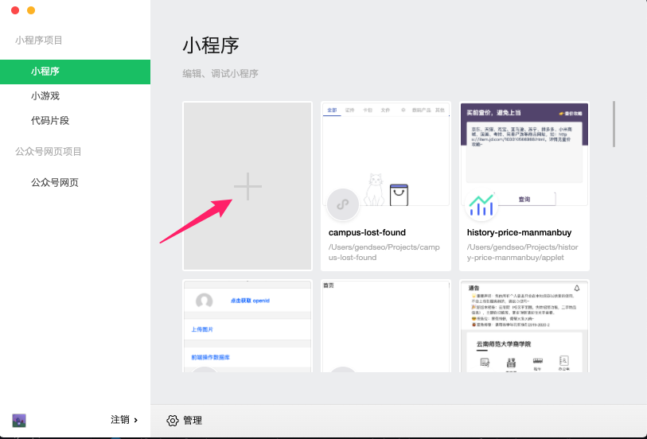
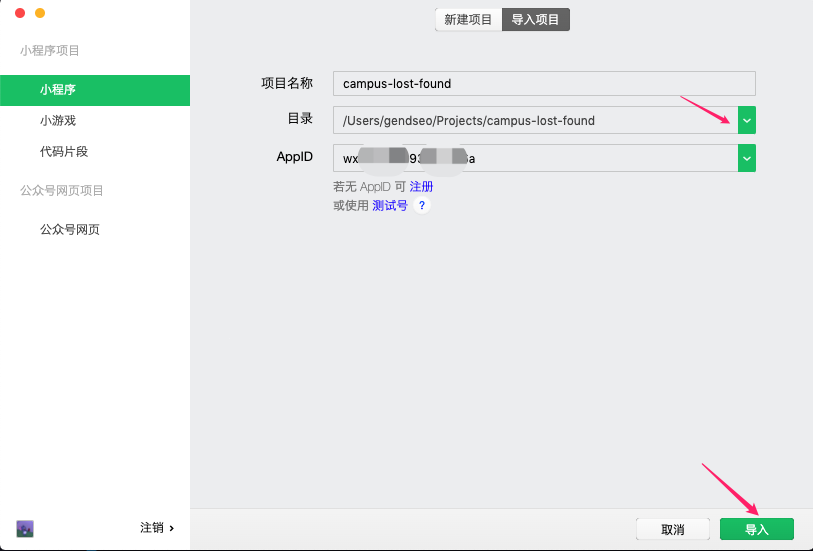
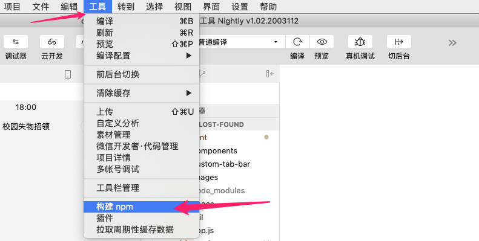
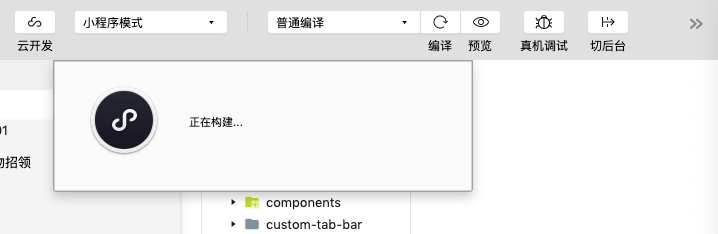
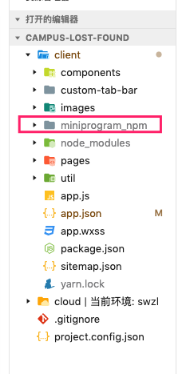
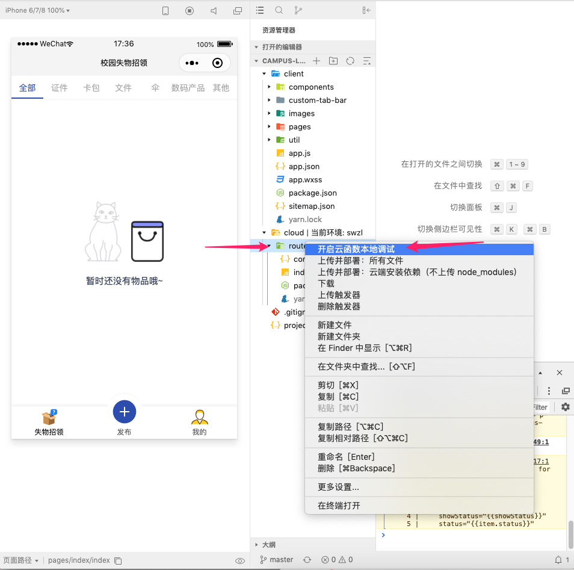
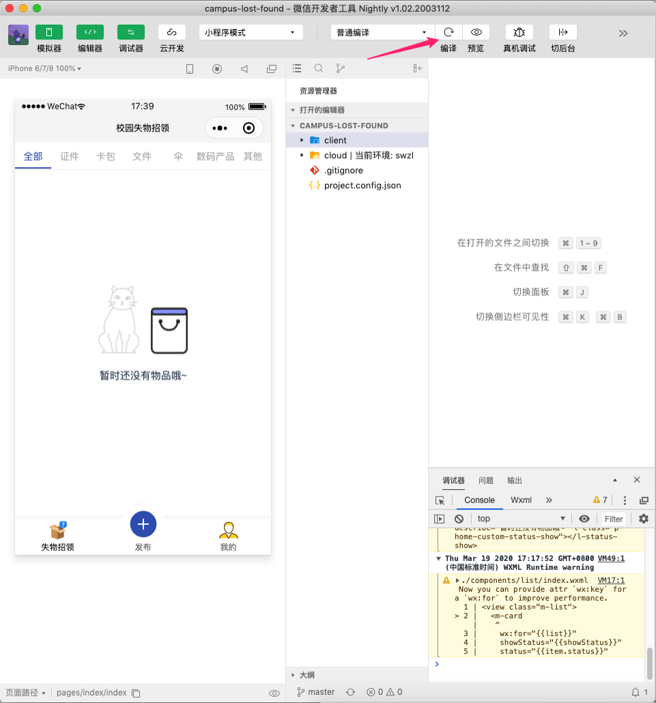
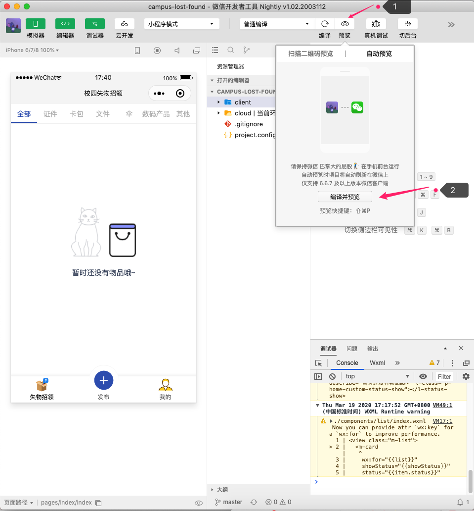

## 商院校园失物招领

client：小程序根目录
cloud：云开发根目录

### 安装Nodejs环境依赖

##### 1、安装[Chocolatey](https://chocolatey.org/install)
##### 2、使用`chocolatey`安装Nodejs

```
choco install -y nodejs-lts
```


### 1、使用微信小程序开发者工具导入项目



 

### 2、安装项目依赖

##### 2.1、使用管理员权限运行cmd，进入`client`文件夹中，执行`npm install`
##### 2.2、使用管理员权限运行cmd，进入`cloud/router`文件夹中，执行`npm install`

##### 2.2、在微信开发者工具中构建npm

- 在上方菜单栏中选择`工具栏`中的`构建npm`





这时候微信开发着工具会在`client`目录中生成`miniprogram_npm`目录




### 3、调试项目

##### 3.1、右键点击`cloud`中的`router`文件夹，选择开启云函数本地调试



##### 3.2、重新编译查看项目



##### 3.3、手机预览



